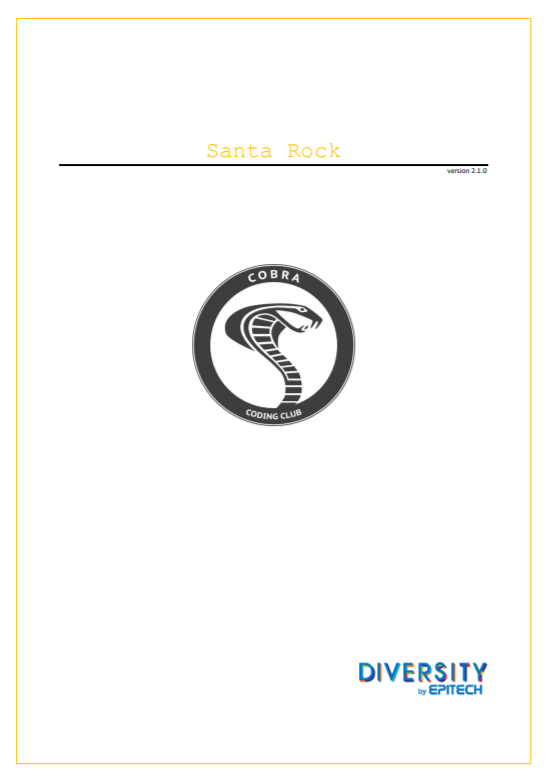
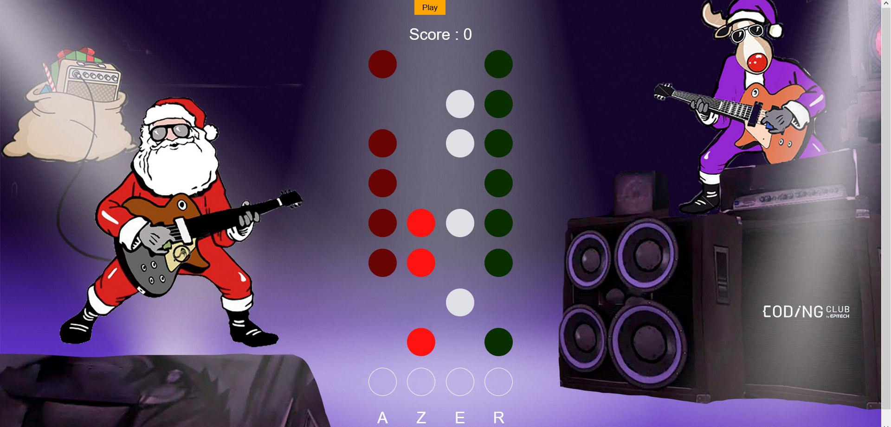

# README

## Présentation

Ce projet a été réalisé dans le cadre du `Christmas Camp` organisé le 21 Décembre 2020 par Epitech.

Lors de ce projet, il s'agissait de réaliser une sorte de "Guitar Hero" , en utilisant les langages Web (HTML, CSS et JS).

Les participants étaient répartis en plusieurs groupes, et j'ai été placée dans le groupe `Salamèche`. Ainsi, nous pouvions nous entraider, et un `Cobra` était là pour nous aider en cas de problème. 

Du à la pandémie, ce Coding Club a eu lieu en ligne, sur la plateforme Discord. Malgré la "distance", on était bien encadré, pour être sûr de ne laisser personne de côté, autant les plus avancés que les complets débutants.

## Bilan

Ce projet m'a permi d'apprendre le JS, que je ne connaisais presque pas, avant. Maintenant, je ssais le lire et à peu près l'écrire.

Passer une journée sur un tel projet m'a conforté dans l'idée de faire de l'informatique mon métier plus tard, même si mon avenir reste pas mal flou. 

Aussi, je me suis découvert une patience pas mal développée. En effet, à la fin, les "tiles" qui rapportent les points n'apparaissaient pas, et même avec ce bug persistant, je n'ai pas abandonné et cherché partout pour avoir une réponse à ma question.

Tout le monde était très gentils et pédagogue, il me tarde de participer à un autre Coding Club, que ça soit en ligne, ou IRL !
